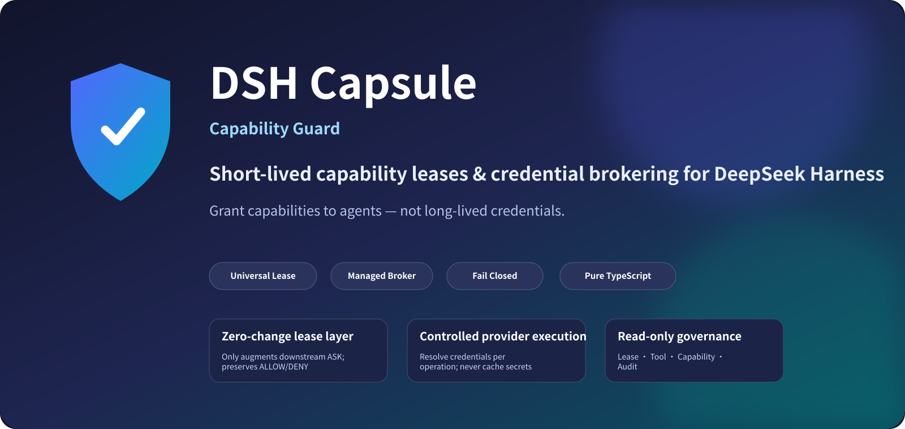
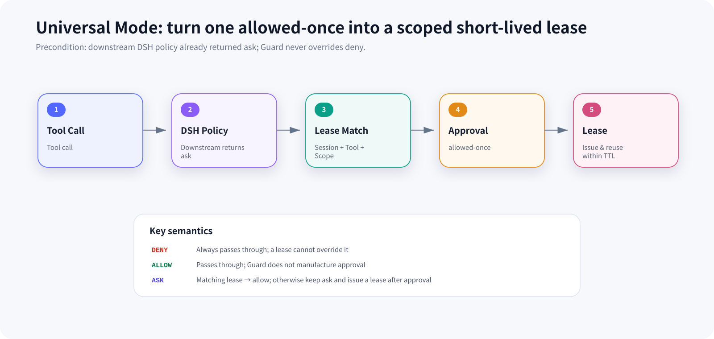
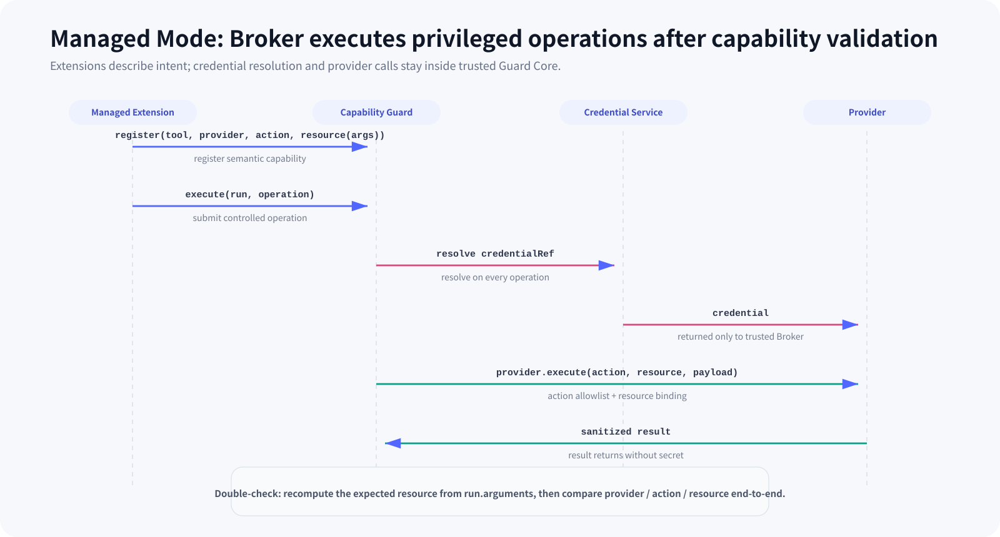
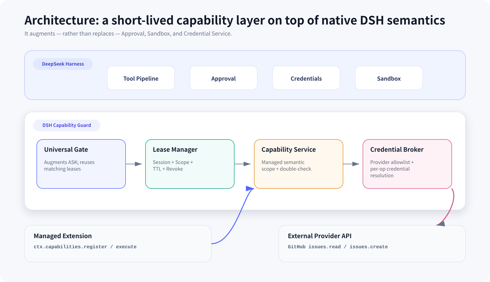
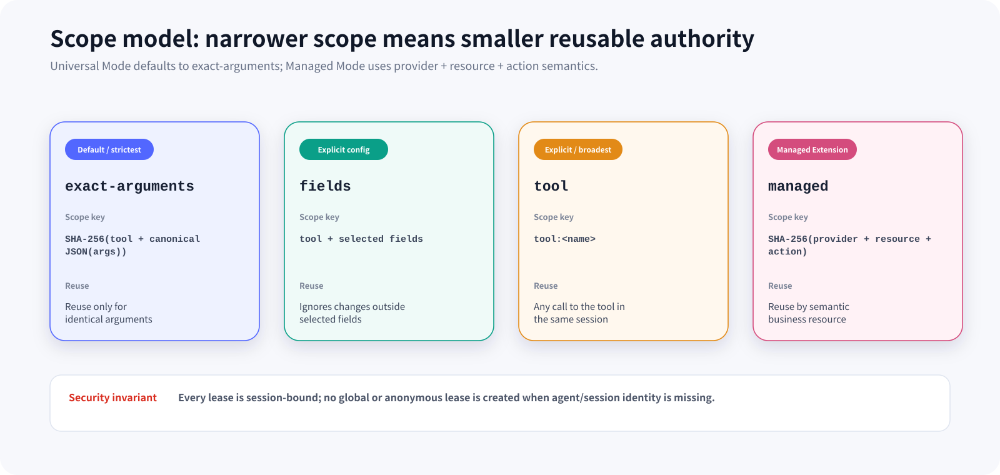
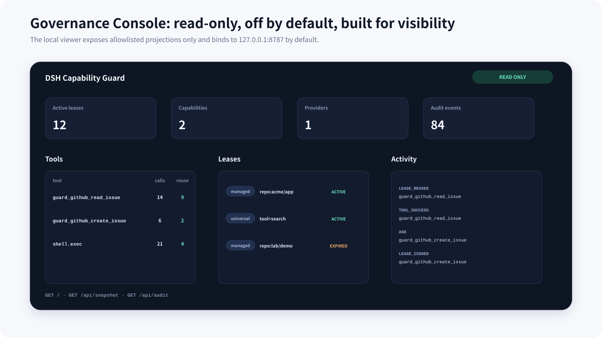
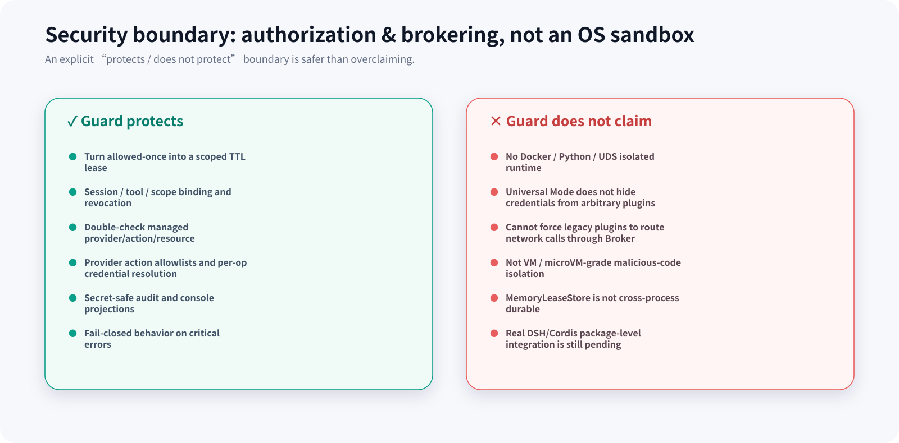

<p align="center">
  
</p>

<p align="center">
  <a href="README.md">简体中文</a> · <a href="README.en.md"><b>English</b></a>
</p>

<p align="center">
  
  
  
  
  
  
</p>

<p align="center">
  <b>Give agents short-lived, revocable, auditable capabilities — not long-lived credentials.</b>
</p>

<p align="center">
  DSH Capsule is a <b>Capability Guard</b> for <a href="https://github.com/deepseek-ai/deepseek-harness">DeepSeek Harness</a>:<br/>
  a zero-change short-lived lease layer for existing tools, plus credential brokering for managed extensions.
</p>

> [!IMPORTANT]
> **The project direction has changed.** The current repository is a pure TypeScript Capability Guard. The former Python / Docker / Unix Domain Socket isolation runtime has been removed. This README documents only capabilities that exist in the current codebase.

> [!WARNING]
> **Developer Preview.** Lease management, Managed Capabilities, Broker, GitHub Provider, Audit, and the Governance Console are implemented in this repository. However, the `adapter` still uses minimal DSH-compatible interfaces and the real DeepSeek Harness / Cordis package-level types and installation path still require integration validation. Do not present the current tree as a production-ready `dsh plugin add` release.

---

## Why DSH Capsule?

Agent tooling often lands at one of two extremes: prompt for approval on every sensitive operation, or hand a plugin a broad, long-lived token. The first hurts usability; the second expands authority too far.

DSH Capsule inserts a **short-lived capability layer** between them:

| Problem | DSH Capsule approach |
|---|---|
| Repeated approval for the same safe operation | Issue a short-lived lease after `allowed-once`; reuse it only within the same Session + Scope |
| Authority is too broad | Bind a lease to `Session × Tool × Scope × TTL` |
| Extensions directly handle long-lived tokens | Managed Extensions submit Operations; Broker resolves credentials per operation |
| Extension lies about target resource/action | Guard recomputes resource from trusted `run.arguments` and compares the full Operation |
| Authority must expire or be withdrawn | Real-time TTL validation + `revoke()` / `revokeSession()` |
| Hard to understand what happened | Secret-safe Audit + read-only Governance Console |
| Security failure falls through | Critical paths are **fail closed** |

In one sentence:

> **Universal Mode decides whether this Tool needs to ask again; Managed Mode decides who may touch credentials and which external operation may execute after approval.**

---

## Two operating modes

### 1. Universal Mode — short-lived authorization for existing tools

If an installed tool is already classified as `ask` by downstream DSH policy, Guard can work across the native `tools/pre-execute` / `approval/request` / `tools/result` path with no tool changes:

- downstream `deny`: always remains `deny`; a lease **never overrides denial**;
- downstream `allow`: passes through unchanged; Guard does not create a new approval;
- downstream `ask`: Guard looks for a matching lease; reuse yields temporary `allow`, otherwise `ask` remains;
- a lease is issued only after the answerer returns `allowed-once`;
- `rejected`, `cancelled`, and `unavailable` never issue a lease.

Universal Mode therefore reduces repetitive approval while preserving native DSH semantics.

<p align="center">
  
</p>

### 2. Managed Mode — privileged operations executed through a Broker

A Guard-aware Managed Extension registers a semantic capability rather than only a tool:

```text
toolName + provider + action + resource(args) + ttl
```

At runtime the extension submits a `BrokerOperation` to `ctx.capabilities.execute()`. Guard then:

1. rebuilds the expected capability from trusted `run.name / run.arguments / run.agent.id`;
2. compares `provider / action / resource` against the registered definition;
3. validates the matching Managed Lease;
4. hands the operation to the trusted Broker;
5. checks the Provider action allowlist;
6. resolves the credential via `ctx.credentials.resolve(ref)` **for every operation**;
7. executes the controlled provider request and returns a whitelisted result.

<p align="center">
  
</p>

The core rule is simple:

> **Extensions pass Operations. The Broker holds authority. Secrets do not need to become extension state.**

---

## Architecture

<p align="center">
  
</p>

Current components:

| Component | Responsibility |
|---|---|
| `UniversalGate` | Cross-cuts the DSH tool pipeline, augments downstream `ask`, handles lease reuse/issuance/audit |
| `PolicyResolver` | Resolves global and tool-level TTL/scope policy and fails closed on invalid policy |
| `ScopeResolver` | Builds `exact-arguments`, `fields`, and `tool` scopes |
| `LeaseManager` | `issue` / `validate` / `findMatching` / `revoke` / `revokeSession` |
| `CapabilityService` | Exposes `ctx.capabilities`, manages semantic Managed Capabilities, and double-checks operations |
| `CredentialBroker` | Provider lookup, action allowlist, per-op credential resolution, timeout and error redaction |
| `ProviderRegistry` | Holds trusted Provider Adapters; extensions do not dynamically register secret-capable providers |
| `GitHubProvider` | Current sample Provider supporting `issues.read` / `issues.create` |
| `AuditService` | In-memory ring buffer that records security events without raw secrets/arguments |
| `GovernanceConsole` | Read-only projection of Plugins / Tools / Capabilities / Leases / Activity / Audit |

### Boundary with native DSH mechanisms

DSH Capsule is **not a second Harness**. It intentionally composes with DSH primitives:

- Approval is still decided by the native `approval/request` answerer;
- later DSH guards may still deny execution;
- credentials still come from the DSH Credential Service;
- process/file/network isolation remains the job of DSH Sandbox or an external isolation mechanism.

Guard adds one thing: **turn a concrete approval into a Session-, Scope-, and TTL-bound short-lived capability, then centralize credential resolution for Managed Mode.**

---

## Capability Lease

A lease is not “this plugin is trusted.” Its identity is:

```text
Session × Tool × Scope × TTL
```

For Managed Capabilities, scope carries business semantics:

```text
Provider × Resource × Action
```

Example:

```text
session:   agent/session-42
tool:      guard_github_read_issue
provider:  github
resource:  repo:acme/platform
action:    issues.read
ttl:       60s
```

Meaning: **this Session may use this Tool to perform `issues.read` on `repo:acme/platform` while the lease remains active** — not “the plugin has GitHub access.”

### Lifecycle

```text
ASK
 └─ allowed-once
      └─ ISSUE ────────┐
                       │
                  ACTIVE
                   ├─ match → REUSE
                   ├─ TTL   → EXPIRED
                   └─ revoke→ REVOKED
```

- TTL is checked against the current clock during `find` / `validate`; security does not rely on a background timer;
- every lease is session-bound; no anonymous/global lease is created when trusted `agent.id` is missing;
- `revoke(leaseId)` revokes one lease;
- `revokeSession(sessionId)` revokes all leases for a Session;
- the current default store is `MemoryLeaseStore`, so leases do not survive process restarts.

---

## Scope — where may approval be reused?

<p align="center">
  
</p>

### `exact-arguments` — default

```text
SHA-256(toolName + canonical JSON(arguments))
```

Only an identical tool call can reuse the lease. This is the strictest zero-configuration strategy for Universal Mode.

### `fields` — explicitly broader

Only selected argument fields enter the scope, e.g. `repo` and `branch`.

### `tool` — broadest

Reuse is based only on tool name within the same Session. This must be explicitly configured and is never the default.

### `managed` — semantic business scope

Managed Extensions deterministically declare:

```text
provider + resource(args) + action
```

Guard hashes the semantic scope and recomputes `resource(args)` from the trusted runtime context before execution, preventing an extension from submitting an Operation that does not match its registered authority.

---

## Why a Credential Broker still matters without Docker

The Broker has value independent of container isolation: **it reduces credential distribution and concentrates privileged provider calls into an auditable trusted path.**

Current Broker constraints:

- the Provider must exist in `ProviderRegistry`;
- the action must be in the Provider `allowedActions` list;
- credentials are **never cached across operations**;
- provider requests have a configurable timeout (default `15s`);
- provider errors are wrapped at the Broker boundary and credential values are replaced with `***`;
- Provider adapters return whitelisted fields;
- the Extension SDK exposes no Credential API.

The built-in GitHub Provider currently allows only:

```text
issues.read
issues.create
```

The repository target is parsed from an already-authorized semantic resource such as `repo:owner/repo`, not from an arbitrary URL supplied to the provider.

---

## Governance Console

<p align="center">
  
</p>

The Console is disabled by default. When enabled it starts a **read-only** local HTTP viewer:

```ts
{
  console: {
    enabled: true,
    host: "127.0.0.1",
    port: 8787,
  }
}
```

It exposes only:

```text
GET /
GET /api/snapshot
GET /api/audit
```

`/api/audit` can filter by `sessionId`, `toolName`, `decision`, and `limit`.

Security properties:

- binds to `127.0.0.1` by default;
- has no write endpoints;
- responses use `no-store`, `nosniff`, and CSP;
- UI data is rendered with `textContent`;
- views are allowlisted projections and exclude credentials, authorization headers, and raw tool arguments.

---

## Quick start

### Requirements

- Node.js `22`
- pnpm `11.25.0` (pinned through the repository `packageManager` field)
- core TypeScript code is cross-platform; CI is configured for Windows / macOS / Linux

> [!NOTE]
> The repository does not yet ship a public DSH package/profile release. The commands below are for **source development**, not the final end-user installation flow.

```bash
git clone <your-repository-url>
cd dsh-capsule

pnpm install --frozen-lockfile
pnpm build
pnpm test
```

Workspace packages:

```text
@dsh-capsule/adapter
@dsh-capsule/extension-sdk
@dsh-capsule/github-demo
```

### Default policy

```ts
{
  enabled: true,
  defaultTtlSeconds: 60,
  maxTtlSeconds: 1800,
  defaultScope: "exact-arguments",
  rules: []
}
```

### Per-tool rules

```ts
{
  enabled: true,
  defaultTtlSeconds: 60,
  maxTtlSeconds: 1800,
  defaultScope: "exact-arguments",
  rules: [
    {
      match: "deploy.preview",
      ttlSeconds: 120,
      scope: {
        mode: "fields",
        paths: ["project", "environment"]
      }
    },
    {
      match: "dangerous.admin",
      enabled: false
    }
  ]
}
```

V1 `match` is an **exact tool-name match**, not glob or regex.

---

## Build a Managed Extension

`@dsh-capsule/extension-sdk` contains types and small helpers only. Lease, Broker, and Credential logic stays inside Guard Core.

### 1. Register a capability

```ts
import { defineCapability } from "@dsh-capsule/extension-sdk";

function repoResource(args: unknown): string {
  const repo = (args as { repo?: unknown })?.repo;
  if (typeof repo !== "string") throw new Error("repo is required");
  return `repo:${repo}`;
}

const readIssue = defineCapability({
  toolName: "guard_github_read_issue",
  provider: "github",
  action: "issues.read",
  resource: repoResource,
  ttlSeconds: 60,
});

const disposeCapability = ctx.capabilities.register(readIssue);
```

### 2. Submit an Operation from the tool

```ts
const args = run.arguments as { repo: string; issue_number: number };

return await ctx.capabilities.execute(run, {
  provider: "github",
  resource: repoResource(args),
  action: "issues.read",
  input: { issue_number: args.issue_number },
});
```

The extension does not get to define the effective resource at execution time. `CapabilityService` calls the registered `resource(args)` again; any mismatch in Provider / Action / Resource raises `CAPABILITY_MISMATCH`.

See the complete example in:

```text
extensions/github-demo/
```

---

## Fail-closed error model

Critical security failures use structured codes rather than silently falling through:

```text
LEASE_REQUIRED
LEASE_REVOKED
LEASE_EXPIRED
LEASE_TTL_INVALID
LEASE_SCOPE_INVALID
LEASE_POLICY_INVALID
CAPABILITY_DENIED
CAPABILITY_MISMATCH
CAPABILITY_NOT_REGISTERED
PROVIDER_NOT_FOUND
ACTION_NOT_ALLOWED
CREDENTIAL_NOT_CONFIGURED
PROVIDER_TIMEOUT
PROVIDER_ERROR
```

The rule:

> **If Guard cannot prove that the current Operation is authorized, it does not execute it.**

---

## Security boundary & non-goals

<p align="center">
  
</p>

### What Universal Mode can claim

- short-lived leases for tools that already trigger `ask`;
- Session / Tool / Scope / TTL binding;
- expiry, revocation, reuse, and audit;
- native `deny` is never overridden;
- existing tools do not need to be rewritten.

### What Universal Mode **cannot** claim

- it does not guarantee that arbitrary third-party plugins cannot see credentials;
- it does not stop a plugin from making network requests it is already able to make;
- it cannot force arbitrary legacy plugins through the Broker;
- it is not process/container/VM/microVM isolation.

### What Managed Mode adds

- Guard-aware extensions do not need a Credential API;
- controlled Provider Operations execute through the Broker;
- Provider / Resource / Action are double-checked;
- Provider actions are allowlisted;
- credentials are resolved per operation;
- provider errors are secret-redacted.

This is still an **architectural trust boundary**, not an OS isolation boundary. If untrusted code isolation is required, compose Guard with the native DSH Sandbox or another external isolation mechanism.

---

## Project status

| Capability | Status |
|---|---|
| Universal Lease Gate | ✅ Implemented |
| Session / Scope / TTL / Revoke | ✅ Implemented |
| Managed Capability Service | ✅ Implemented |
| Credential Broker | ✅ Implemented |
| GitHub `issues.read` / `issues.create` Provider | ✅ Implemented |
| Secret-safe Audit | ✅ Implemented |
| Read-only Governance Console | ✅ Implemented |
| TypeScript Extension SDK | ✅ Implemented |
| GitHub Managed Extension Demo | ✅ Implemented |
| Ubuntu / Windows / macOS CI workflow | ✅ Configured |
| Real DSH/Cordis types & Loader integration | 🚧 Pending |
| Public installable DSH release package | 🚧 Pending |
| Durable Lease Store | 🗺️ Roadmap |
| More Trusted Providers | 🗺️ Roadmap |

DeepSeek Harness itself is in Developer Preview and moving quickly, so the final integration should be validated against the TypeScript types of the actual installed DSH version rather than treating event shapes as a permanent compatibility promise.

---

## Repository layout

```text
.
├── adapter/
│   └── src/
│       ├── index.ts                 # Guard composition entry
│       ├── capability/
│       │   ├── universal-gate.ts    # DSH Tool / Approval / Result gate
│       │   ├── policy.ts            # TTL / Scope policy
│       │   ├── scope-resolver.ts    # Universal scope
│       │   ├── lease-manager.ts     # Lease lifecycle
│       │   ├── lease-store.ts       # MemoryLeaseStore
│       │   └── pending.ts           # callId concurrency isolation
│       ├── service/
│       │   └── capability-service.ts
│       ├── broker/
│       │   ├── broker.ts
│       │   ├── registry.ts
│       │   └── providers/github.ts
│       ├── audit/
│       └── console/
├── sdk/typescript/                  # @dsh-capsule/extension-sdk
├── extensions/github-demo/          # Managed Extension example
└── .github/workflows/ci.yml         # three-OS build + test
```

---

## Design principles

**Preserve DSH semantics.** Guard augments `ask`; it does not override `deny` or reinvent Approval.

**Short-lived authority.** Every reusable grant needs an explicit Session, Scope, and TTL.

**Capabilities over credentials.** Managed Extensions request business operations instead of owning long-lived secrets.

**Deterministic scope.** Security boundaries come from deterministic rules, never from LLM guesses about Provider / Resource / Action.

**Fail closed.** If identity, scope, TTL, provider, action, or credential cannot be verified, execution is rejected.

**Secret-safe observability.** Audit and Console expose allowlisted governance fields only.

**Small trusted core.** Providers live in trusted Guard Core; the Extension SDK remains intentionally thin.

---

## FAQ

### How is this different from RBAC?

RBAC answers “what may this role generally do?” A Capability Lease answers **whether this Session may use this Tool on this Scope right now, within this TTL**. That is a better fit for dynamic, short-lived agent workflows.

### Does the Broker still matter without Docker?

Yes. Its main value is **reducing secret distribution, centralizing provider policy, and creating one auditable path for privileged operations**. Without OS isolation, however, it is an architectural constraint rather than a malicious-code isolation boundary.

### Does Universal Mode protect every third-party plugin?

It can add short-lived leases to tools that already reach the DSH `ask` path with no plugin rewrite. It cannot force arbitrary plugins through the Broker or remove resources that their process already has.

### Does it support Windows, macOS, and Linux?

The current main path is pure TypeScript and has no Python / Docker / Unix Domain Socket dependency. The repository CI is configured for all three OS families. Real DSH integration still needs compatibility validation against the target DSH version.

### Why is `exact-arguments` the default scope?

Because a generic guard cannot safely infer business-resource semantics for arbitrary third-party tools. Reusing only identical arguments is deliberately conservative.

---

## Roadmap

Near-term priorities:

1. integrate the Adapter against real DeepSeek Harness / Cordis package types;
2. add a reproducible DSH Loader/Profile installation example and compatibility matrix;
3. provide optional durable implementations behind the Lease Store abstraction;
4. add more Trusted Providers with narrow action schemas;
5. deepen read-only governance and observability without turning the Console into an authority-changing UI;
6. publish a stable Extension SDK and minimal Managed Extension template.

---

## Contributing

Security infrastructure benefits most from **negative tests and explicit boundaries**. Useful contributions include:

- Lease / Scope / Session isolation tests;
- concurrent `callId`, cancellation, and lifecycle race tests;
- credential leakage regression tests;
- Trusted Providers with narrow action schemas;
- DSH version compatibility validation;
- documentation and reproducible integration examples.

If a change expands the trusted computing base, gives extensions direct secret access, or bypasses native DSH Approval / Sandbox semantics, discuss the design before implementation.

---

## License

MIT License. See [`LICENSE`](LICENSE).

<p align="center">
  <b>DSH Capsule</b><br/>
  <sub>Short-lived capabilities · Brokered credentials · Fail-closed by design</sub>
</p>
