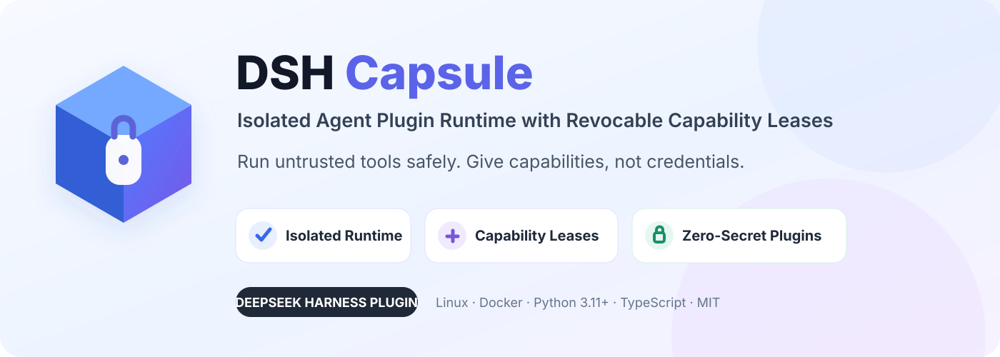
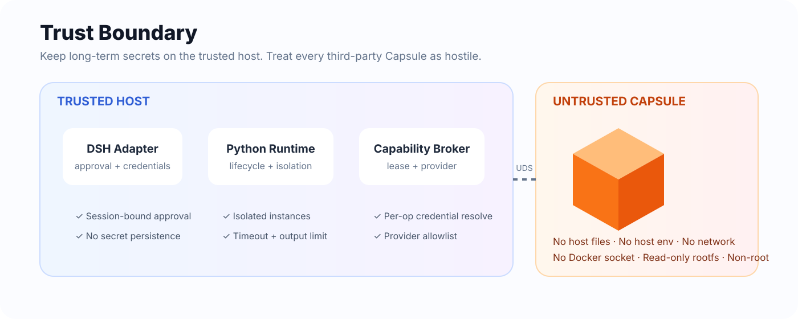
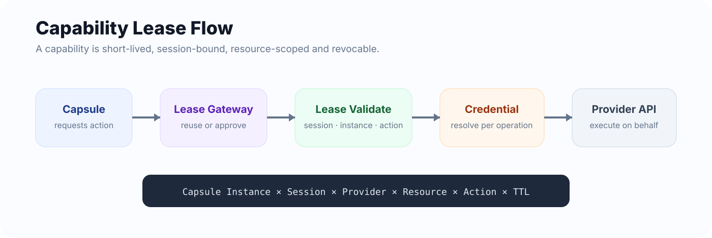
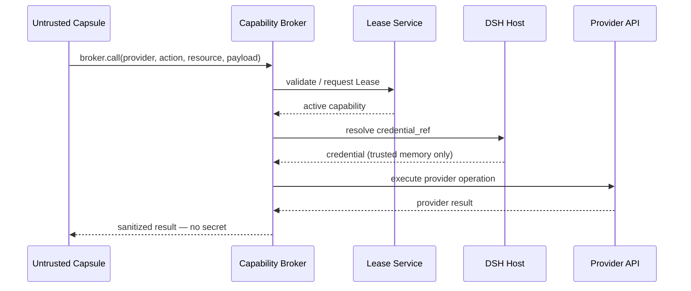
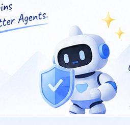

<p align="center">
  
</p>

<p align="center">
  <a href="#deepseek-harness-plugin"></a>
  <a href="#deepseek-harness-plugin"></a>
  
  
  
  
</p>

<p align="center">
  <b>Run untrusted Agent tools safely. Give capabilities, not credentials.</b>
</p>

<p align="center">
  DSH Capsule is an isolated third-party Tool Plugin runtime for <b>DeepSeek Harness</b>.<br/>
  Untrusted plugin code runs inside a restricted Docker Capsule, while a trusted host-side broker mediates external capabilities through short-lived, session-bound, revocable leases.
</p>

<p align="center">
  <a href="#-why-dsh-capsule">Why Capsule?</a> ·
  <a href="#-architecture">Architecture</a> ·
  <a href="#-security-model">Security</a> ·
  <a href="#-quick-start">Quick Start</a> ·
  <a href="#-build-a-capsule">Build a Capsule</a> ·
  <a href="#-security-in-action">Security Tests</a> ·
  <a href="#-roadmap">Roadmap</a>
</p>

---

## DeepSeek Harness Plugin

> **DSH Capsule is built as an independent DeepSeek Harness Plugin.** It does not modify DeepSeek Harness Core.

The DSH-facing TypeScript adapter is intentionally thin: lifecycle integration, approval, credential resolution, and bidirectional RPC. Security-sensitive execution logic lives in the Python Runtime, outside the Agent process.

> [!IMPORTANT]
> **Current status:** the isolated Runtime, Capsule lifecycle, Broker, Capability Lease, GitHub provider, SDK, CLI and security test scaffolding are implemented. Automatic `capsule.list_tools → ctx.tools.register()` wiring in the DSH adapter is still being integrated and is intentionally **not** claimed as complete.

---

## ✦ Why DSH Capsule?

Modern Agent systems are increasingly extensible. That is powerful — and dangerous.

A third-party Tool Plugin may contain vulnerable dependencies, attempt to read host files, inspect environment variables, access Docker, call the public network directly, retain long-lived credentials, or simply hang forever.

Traditional plugin execution often collapses two very different questions into one:

1. **Can this plugin code run?**
2. **What is this plugin allowed to do right now?**

DSH Capsule separates them.

<table>
<tr>
<td width="33%" valign="top">
<h3>🛡️ Isolated Runtime</h3>
Third-party code runs outside the Harness process in a restricted Docker container with an explicit security baseline.
</td>
<td width="33%" valign="top">
<h3>🔑 Capability Leases</h3>
External actions are granted through short-lived, session-bound, resource-scoped and revocable permissions.
</td>
<td width="33%" valign="top">
<h3>🔒 Zero-Secret Plugins</h3>
Long-lived host credentials are resolved on the trusted side per operation and never injected into the plugin container.
</td>
</tr>
</table>

### One sentence

> **The plugin can do work without owning the host.**

---

## 🧭 Architecture

```mermaid
flowchart LR
    A[DSH Agent] --> B[DSH Tool Registry]
    B --> C[TypeScript Adapter\nTrusted / Thin]
    C <-->|Bidirectional NDJSON JSON-RPC\nstdin / stdout| D[Python Capsule Runtime\nTrusted Core]
    D --> E[Capsule Manager]
    E <-->|per-instance Unix Domain Socket| F[Docker Capsule\nUNTRUSTED]
    F -->|broker.call| G[Capability Broker\nTrusted Host]
    G --> H[Lease Validation]
    H --> I[Credential Resolve\nper operation]
    I --> J[Provider Adapter]
    J --> K[External API]
    K --> J --> G --> F

    style F fill:#fff1f2,stroke:#fb7185,color:#881337
    style C fill:#eef2ff,stroke:#818cf8,color:#312e81
    style D fill:#eff6ff,stroke:#60a5fa,color:#1e3a8a
    style G fill:#ecfdf5,stroke:#34d399,color:#14532d
```



### Design rule: thin adapter, trusted core

```text
Agent
  │
  ▼
DeepSeek Harness
  │
  ▼
TypeScript Adapter        ← DSH integration only
  │
  │  NDJSON JSON-RPC
  ▼
Python Runtime            ← lifecycle / isolation / lease / broker / storage
  │
  │  Unix Domain Socket
  ▼
Docker Capsule            ← third-party code, always untrusted
  │
  │  broker.call
  ▼
Capability Broker         ← validates authority, resolves secret, calls provider
```

The adapter **does not become a second business runtime**. This keeps the DSH integration surface small and puts the security model in one place.

---

## 🧱 Security Model

<p align="center">
  
</p>

### Trust boundary

| Zone | Components | Assumption |
|---|---|---|
| **Trusted** | DSH Core, TS Adapter, Python Runtime, Lease DB, Provider Adapters | May handle host identity and credentials |
| **Untrusted** | Capsule code, Capsule dependencies, Capsule input | Must never receive ambient host authority |
| **Semi-trusted** | Docker Engine, external provider APIs | Required infrastructure / external systems |

### Docker isolation baseline

Each Capsule is started with an explicit deny-by-default baseline equivalent to:

```bash
--read-only
--network none
--cap-drop ALL
--security-opt no-new-privileges
--memory 256m
--pids-limit 64
--cpus 0.5
--tmpfs /tmp:rw,noexec,nosuid,size=64m
```

Additionally:

- runs as a non-root user (`65534:65534`)
- no host workspace mount
- no `~/.dsh` mount
- no Docker Socket mount
- no host network
- no privileged mode
- no bulk host environment injection
- only the instance-scoped IPC directory is writable
- tool invocation timeout defaults to **30s**
- provider request timeout defaults to **15s**
- a single RPC response is capped at **2 MB**

> [!NOTE]
> Docker is a containment boundary for this MVP, not a claim of VM-grade isolation. microVM, eBPF, custom seccomp generation and Kubernetes are intentionally outside the current scope.

---

## 🔑 Capability Leases

<p align="center">
  
</p>

A plugin does **not** receive broad access such as “GitHub allowed”. It receives a narrowly scoped lease bound to runtime context:

```text
Capsule Instance × Session × Provider × Resource × Action × TTL
```

For example:

```text
instance:  cap_8f1...
session:   sess_42
provider:  github
resource:  repo:owner/project
 action:   issues.read
TTL:       600 seconds
```

The Lease lifecycle supports:

- **issue** after host approval
- **reuse** for matching active authority
- **expire** automatically by time
- **revoke** a single Lease
- **revoke-session**
- **revoke-capsule**
- reject **cross-session reuse**
- reject **cross-instance reuse**
- reject **undeclared actions**
- **Fail Closed** on every abnormal validation path

### Why not ordinary RBAC?

RBAC answers: _“What can this role generally do?”_

Capability Lease answers: _“Can this exact Capsule instance, in this exact Agent session, perform this exact action on this exact resource right now?”_

That distinction matters for long-running and tool-augmented Agents.

---

## 🔒 Credentialless Plugin Execution

The Capsule never needs the host's long-lived token.



**Credential properties:**

- resolved **per provider operation**
- not persisted to SQLite
- not injected into Capsule environment
- not returned in Tool Result
- not intentionally included in logs or errors
- provider access is constrained by manifest-declared allowlists

The result is a simple rule:

> **Authority may cross the boundary. Secrets do not.**

---

## ⚙️ Runtime Internals

### Two IPC layers

| Path | Protocol | Purpose |
|---|---|---|
| **TypeScript ↔ Python** | Bidirectional NDJSON JSON-RPC over stdin/stdout | DSH lifecycle, tool calls, host approval, credential resolution |
| **Python ↔ Capsule** | Per-instance Unix Domain Socket | isolated tool invocation and Broker requests |

Python stdout is reserved for RPC. Runtime logs go to stderr so protocol traffic cannot be corrupted by ordinary logs.

### Runtime RPC surface

Current trusted Runtime exposes methods including:

```text
system.ping
system.call_host
capsule.list_tools
capsule.invoke
lease.request
```

Host callbacks include:

```text
host.approval.request_lease
host.credential.resolve
```

---

## 🧪 Security in Action

DSH Capsule includes a deliberately hostile `malicious-demo` Capsule. It exists to attack the Runtime, not to demonstrate happy-path behavior.

| Attack probe | Expected boundary |
|---|---|
| Read host-side files | Capsule only sees its own container filesystem |
| Dump host environment | only explicitly injected non-sensitive runtime vars are visible |
| Direct outbound TCP | blocked by `network none` |
| Access `/var/run/docker.sock` | unavailable because it is never mounted |
| Write `/app`, `/etc`, `/usr`, `/var` | blocked by read-only root filesystem |
| Return > 2 MB payload | rejected by response limit |
| Infinite loop | terminated by invocation timeout path |
| Crash plugin process | crash contained to Capsule instance |
| Call undeclared Broker action | denied by Broker policy |
| Reuse Lease across Session | denied |
| Reuse Lease across instance | denied |
| Use expired / revoked Lease | denied |

Example hostile tool:

```python
@app.tool("try_unauthorized_broker_action")
async def try_unauthorized_broker_action(args: dict, ctx) -> dict:
    return await ctx.broker.call(
        provider="github",
        action="repo.delete",            # not declared by manifest
        resource="repo:foo/bar",
        payload={},
    )
```

The expected outcome is **`CAPABILITY_DENIED`**, not “best effort”.

---

## 🚀 Quick Start

### Requirements

- Linux
- Docker Engine
- Python **3.11+**
- `uv` recommended for Python dependency management
- Node.js + pnpm for the TypeScript adapter

### 1. Clone

```bash
git clone <your-repository-url>
cd dsh-capsule
```

### 2. Install Python Runtime dependencies

```bash
cd runtime
uv sync --dev
cd ..
```

### 3. Build example Capsules

```bash
docker build -t dsh-capsule/hello:0.1.0 capsules/hello
docker build -t dsh-capsule/github-reader:0.1.0 capsules/github-reader
docker build -t dsh-capsule/malicious-demo:0.1.0 capsules/malicious-demo
```

### 4. Run Python tests

```bash
uv run --project runtime pytest -q
```

Run only security scenarios:

```bash
uv run --project runtime pytest tests/security -q
```

### 5. Build and test the DSH adapter

```bash
pnpm install
pnpm build
pnpm test
```

### 6. Runtime smoke test

The Runtime speaks NDJSON JSON-RPC over stdin/stdout. A minimal ping request is:

```json
{"jsonrpc":"2.0","id":1,"method":"system.ping","params":{}}
```

Expected response:

```json
{"jsonrpc":"2.0","id":1,"result":{"pong":true}}
```

> [!WARNING]
> End-to-end DSH Tool auto-registration is currently being wired through `ctx.tools.register()`. Until that adapter step lands, treat the project as an active **MVP / Developer Preview**, not a finished production package.

---

## 📦 Build a Capsule

A Capsule has three pieces:

```text
my-capsule/
├── capsule.yaml
├── Dockerfile
└── app.py
```

### 1. Declare the manifest

```yaml
apiVersion: dsh-capsule/v1
kind: Capsule

metadata:
  id: github-reader
  version: 0.1.0
  description: Read GitHub issues through the trusted broker.

runtime:
  image: dsh-capsule/github-reader:0.1.0
  command:
    - python
    - /app/app.py

resources:
  memory_mb: 256
  cpus: 0.5
  pids: 64

credentials:
  - provider: github
    credential_ref: GITHUB_TOKEN
    allowed_actions:
      - issues.read
    default_ttl_seconds: 600
    max_ttl_seconds: 1800

tools:
  - name: github_get_issue
    description: Read one GitHub issue from a repository.
    parameters:
      type: object
      additionalProperties: false
      required: [repo, issue_number]
      properties:
        repo:
          type: string
        issue_number:
          type: integer
          minimum: 1
```

### 2. Implement the tool with the Python SDK

```python
from dsh_capsule_sdk.tool import CapsuleApp

app = CapsuleApp()

@app.tool("hello_capsule")
async def hello_capsule(args: dict, ctx) -> dict:
    name = args.get("name", "world")
    return {"message": f"hello, {name}"}

if __name__ == "__main__":
    app.run()
```

### 3. Request an external capability — not a secret

```python
result = await ctx.broker.call(
    provider="github",
    action="issues.read",
    resource="repo:owner/project",
    payload={"issue_number": 42},
)
```

The Capsule does not receive `GITHUB_TOKEN`. The trusted host resolves it only after the lease and manifest policy are satisfied.

---

## 🧩 Example Capsules

| Capsule | Purpose | Security relevance |
|---|---|---|
| `hello` | minimal isolated tool | verifies lifecycle + invocation |
| `github-reader` | read GitHub issue through Broker | demonstrates capability + credential separation |
| `malicious-demo` | intentionally hostile plugin | probes host files, env, network, Docker socket, output limits, hangs, crashes and unauthorized actions |

---

## 🛠️ CLI

The repository includes `capsulectl.py` for Lease administration.

Conceptually supported operations include:

```text
leases
revoke <lease-id>
revoke-session <session-id>
revoke-capsule <capsule-id>
```

This makes capability revocation an operational control rather than a theoretical property.

---

## 🧯 Fail-Closed Error Model

Security-sensitive failures use explicit error codes instead of silently falling through.

Examples include:

```text
LEASE_REQUIRED
LEASE_REVOKED
LEASE_EXPIRED
LEASE_SESSION_MISMATCH
LEASE_CAPSULE_MISMATCH
CAPABILITY_DENIED
PROVIDER_NOT_FOUND
PROVIDER_TIMEOUT
CAPSULE_TIMEOUT
CAPSULE_OUTPUT_TOO_LARGE
CAPSULE_PROTOCOL_ERROR
CAPSULE_UNAVAILABLE
```

The rule is intentionally boring:

> If authorization cannot be proven, the operation does not happen.

---

## 🗂️ Repository Layout

```text
.
├── adapter/                  # thin TypeScript DSH adapter
│   └── src/
│       ├── index.ts
│       ├── rpc-client.ts
│       ├── tool-loader.ts
│       ├── approval.ts
│       └── credentials.ts
│
├── runtime/                  # trusted Python core
│   └── dsh_capsule/
│       ├── capsule/          # manifest / instance / manager / Docker backend
│       ├── lease/            # models / service / gateway / approval
│       ├── broker/           # policy / server / credentials / providers
│       ├── storage/          # SQLite Lease store
│       ├── rpc.py
│       └── main.py
│
├── sdk/python/               # Capsule author SDK
├── capsules/
│   ├── hello/
│   ├── github-reader/
│   └── malicious-demo/
│
├── cli/                      # capsulectl
└── tests/
    ├── unit/
    ├── integration/
    └── security/
```

---

## 🧠 Design Principles

### 1. Untrusted means untrusted

The security model does not assume plugin authors are friendly or careful.

### 2. No ambient authority

A Capsule should not inherit host files, host network, host credentials or the Docker control plane merely because it was installed.

### 3. Capabilities over credentials

Plugins request narrowly-scoped actions. They do not own the underlying long-term secret.

### 4. Authorization is contextual

A permission valid for one Agent session or Capsule instance is not automatically valid for another.

### 5. Security checks fail closed

Missing state, stale authority, policy mismatch and protocol errors are denial conditions.

### 6. Keep the DSH surface thin

DeepSeek Harness integration belongs in TypeScript; Runtime and policy logic stay in the trusted Python core.

---

## 📊 MVP Scope

### In scope

- [x] Python trusted Runtime
- [x] restricted Docker Capsule execution
- [x] per-instance Unix Socket IPC
- [x] manifest-driven resources and declared tools
- [x] short-lived Capability Lease model
- [x] session / instance / action validation
- [x] active Lease revocation
- [x] trusted Credential Resolver callback
- [x] Provider allowlist policy
- [x] GitHub provider prototype
- [x] Python Capsule SDK
- [x] malicious Capsule security probes
- [x] unit / integration / security test structure
- [x] TypeScript ↔ Python bidirectional RPC
- [x] host approval / credential callback handlers
- [ ] DSH `ctx.tools.register()` automatic Capsule Tool registration
- [ ] end-to-end DSH demo recording / release package

### Deliberately out of scope for MVP

- Windows / macOS container runtime support
- Kubernetes
- microVM isolation
- eBPF policy enforcement
- generic HTTP proxy
- arbitrary Cordis plugin compatibility
- Web UI
- plugin signing / Sigstore
- SBOM pipeline
- Redis / PostgreSQL

Keeping the MVP narrow is a security feature: fewer moving parts, clearer trust boundaries, easier review.

---

## 🗺️ Roadmap

```mermaid
flowchart LR
    A[Runtime Core] --> B[Docker Isolation]
    B --> C[Capability Lease]
    C --> D[Credential Broker]
    D --> E[Security Probes]
    E --> F[DSH Tool Registration]
    F --> G[Audit / Trace]
    G --> H[Plugin Supply Chain]

    style A fill:#dcfce7,stroke:#22c55e
    style B fill:#dcfce7,stroke:#22c55e
    style C fill:#dcfce7,stroke:#22c55e
    style D fill:#dcfce7,stroke:#22c55e
    style E fill:#dcfce7,stroke:#22c55e
    style F fill:#fef3c7,stroke:#f59e0b
    style G fill:#f8fafc,stroke:#94a3b8
    style H fill:#f8fafc,stroke:#94a3b8
```



Near-term priorities:

1. finish `capsule.list_tools → ctx.tools.register()` integration against the installed DSH TypeScript API
2. run the complete Linux + Docker CI matrix and publish reproducible results
3. add secret-safe Audit / Trace events for invocation, lease decision and provider execution
4. tighten local IPC ownership / permissions
5. add explicit Tool name collision rejection

Later, after the Runtime boundary is stable: image digest pinning, SBOM and plugin provenance/signature verification.

---

## 🖼️ Project Visual

<p align="center">
  
</p>

<p align="center"><i>Safe plugins. Scoped capabilities. No ambient secrets.</i></p>

---

## 🤝 Contributing

Security infrastructure benefits from adversarial review.

Good contributions include:

- new malicious Capsule probes
- Lease / Broker negative tests
- additional provider adapters with narrow action schemas
- IPC hardening
- lifecycle race-condition tests
- documentation improvements

Before adding a large dependency or broadening the runtime surface, open a design discussion first. The project intentionally favors a small trusted computing base.

---

## 🔐 Security

Please do not treat the current MVP as a hardened multi-tenant cloud sandbox.

If you discover a boundary escape, secret exposure path, lease validation bypass or Broker policy bypass, report it privately rather than publishing a working exploit in a public issue.

---

## 📜 License

MIT License. See [LICENSE](LICENSE).

---

<details>
<summary><b>中文介绍</b></summary>
<br/>

**DSH Capsule** 是面向 DeepSeek Harness 的隔离式第三方 Tool Plugin Runtime。

它解决两个核心问题：

1. **第三方插件代码怎么安全运行？** —— 插件下沉到受限 Docker Capsule，默认无宿主文件、无宿主环境变量、无公网网络、无 Docker Socket、非 Root、只读 RootFS，并施加 CPU / Memory / PID / Timeout / Output Limit。
2. **插件怎么访问 GitHub 等真实外部能力，又不拿到长期 Token？** —— 通过可信宿主 Broker + 短期 Capability Lease，把权限绑定到 `Capsule Instance × Session × Provider × Resource × Action × TTL`，Credential 每次操作动态解析，Secret 永不进入插件容器。

一句话：

> **插件可以做事，但插件不需要拥有宿主。**

当前 Runtime 安全核心已经实现，DSH Adapter 的自动 Tool 注册仍在接入中，因此项目状态为 MVP / Developer Preview。

</details>

<p align="center">
  <b>Built for DeepSeek Harness · Designed for an open Agent ecosystem with explicit trust boundaries.</b>
</p>
