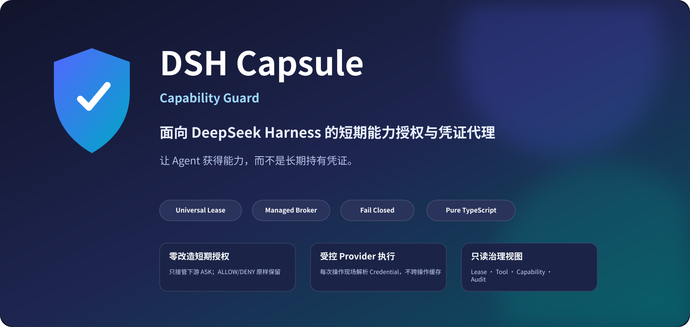
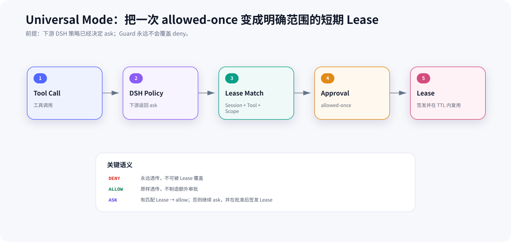
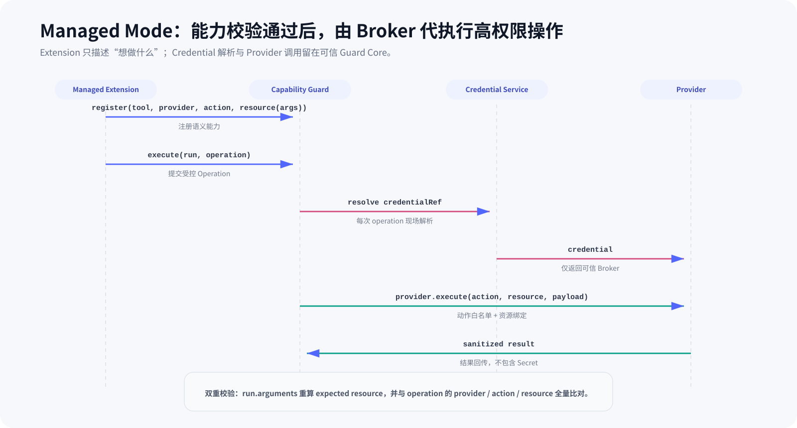
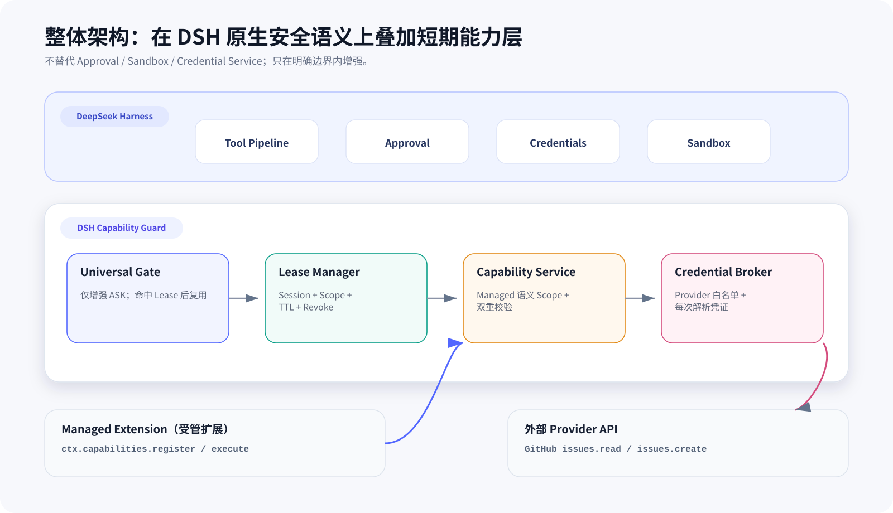
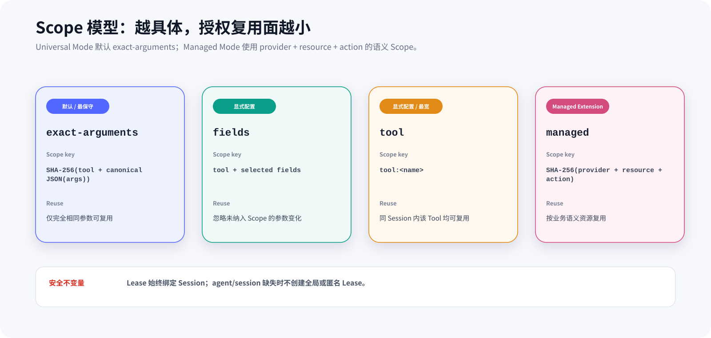
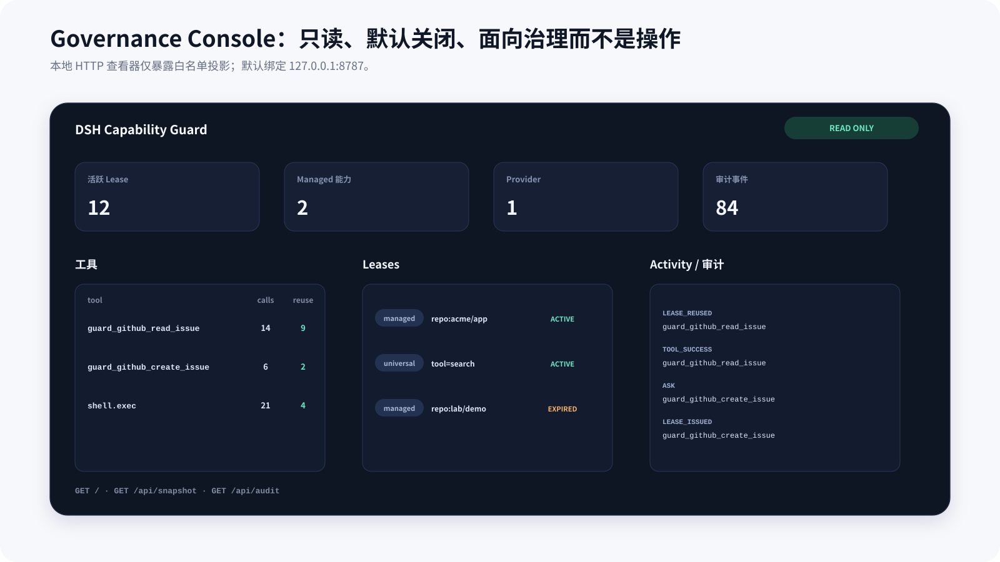
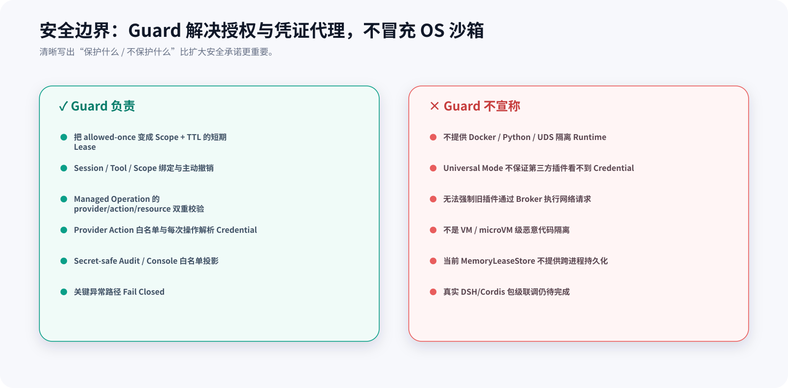

<p align="center">
  
</p>

<p align="center">
  <a href="README.md"><b>简体中文</b></a> · <a href="README.en.md">English</a>
</p>

<p align="center">
  
  
  
  
  
  
</p>

<p align="center">
  <b>让 Agent 获得短期、可撤销、可审计的能力，而不是长期持有凭证。</b>
</p>

<p align="center">
  DSH Capsule 是面向 <a href="https://github.com/deepseek-ai/deepseek-harness">DeepSeek Harness</a> 的 <b>Capability Guard</b>：<br/>
  对已有 Tool 提供零改造的短期 Lease 层；对受管扩展提供 Credential Broker 与 Provider 代理执行。
</p>

> [!IMPORTANT]
> **项目定位已经变化。** 当前仓库是纯 TypeScript 的 Capability Guard，不再包含旧版 Python / Docker / Unix Domain Socket 隔离 Runtime。本文只描述当前代码真实存在的能力。

> [!WARNING]
> **Developer Preview。** 核心链路（Lease、沙箱升级有界授权、Managed Capability、Broker、Audit、Console）已在仓库实现，并有**真 cordis 集成测试**守护 hook 接线；但尚未在真实 profile 中作为插件端到端实跑，也还没有可直接安装的发行包（缺 `dsh.bundle.patch`）。
>
> DSH 本身仍在快速迭代：本仓库与本机安装版源码的核对结论记录在 `docs/集成基线-真实DSH行为.md`，**升级 DSH 后请重跑该文档第 10 节的检查清单**。

---

## 为什么需要它？

DSH 原生的权限体系有两层，中间是空的：

| DSH 原生 | 粒度 | 代价 |
|---|---|---|
| `permission-presets`（会话级沙箱 + 审批组合） | 一次生效、覆盖面广 | 粗：一放开就是整个会话 |
| `allowed-once`（单次审批） | 精确到这一次调用 | 细但每次都要问 |

缺的那一层是：**「这个 Session 内、这个工具、这类操作，在一段时间内已经批过了」**——既有界、又能复用、还能撤销与审计。

DSH Capsule 补的就是这一层：

| 问题 | DSH Capsule 的处理方式 |
|---|---|
| 同一个安全操作反复弹审批 | `allowed-once` 后签发短期 Lease，在相同 Scope + Session 内复用 |
| 授权范围太宽 | Lease 绑定 `Session × Tool × Scope × TTL` |
| 授权无法自动收回 | TTL 到期回收；沙箱模式提升还会**回滚到批准前的档位** |
| 插件直接接触长期 Token | Managed Extension 只提交 Operation，Broker 每次调用时动态解析 Credential |
| 插件伪造资源或 Action | Guard 从可信 `run.arguments` 重算资源，再与 Operation 做完整比对 |
| 发生了什么难以追踪 | Secret-safe Audit + 只读 Governance Console（放宽/回滚都会留痕） |
| 安全失败被静默放行 | 关键路径统一 **Fail Closed** |

一句话理解：

> **Universal Mode 管“这个 Tool 现在还要不要再问一次”；Managed Mode 管“批准后谁能拿凭证、能执行什么外部操作”。**

---

## 两种工作模式

### 1. Universal Mode — 已有插件零改造获得短期授权

Guard 工作在 DSH 原生工具管线的**四个** hook 上（`tools/pre-execute` / `tools/execute` / `approval/request` / `tools/result`），原始语义保持不变：

- 原始 `deny`：始终保持 `deny`，Lease **不能覆盖拒绝**；
- 原始 `allow`：直接透传，Guard 不制造新的 Approval；
- 原始 `ask`：先查找匹配 Lease；命中则临时 `allow`，否则继续 `ask`；
- 用户返回 `allowed-once` 后，Guard 才签发带 Scope 与 TTL 的 Lease；
- `rejected` / `cancelled` / `unavailable` 均不签发。

> **沙箱升级（sandbox escalation）是当前最有价值的一条链路。** 它经过了与本机安装版 DSH 源码的逐行核对（结论见 `docs/集成基线-真实DSH行为.md`）：
>
> DSH 的 `tools/pre-execute` **落底决策就是 `allow`**，标准 profile 下没有任何随产品交付的监听器会返回 `ask`。真实审批来自 pwsh/bash/fs **工具体内部**的 `approveEscalation → ctx.approval.request(...)`（例如文件写入越出工作区时，模型带 `sandbox_permissions` + `justification` 重试）。
>
> 因此 Guard 的接入点是：在 `tools/execute`（工具体之前、参数仍可用）识别这次升级并按 **`(toolName, 目标模式)`** 生成语义 Scope；用户批准一次后签发 `sandbox-mode` Lease，并**提升该会话的沙箱模式**——后续同类升级不会被沙箱拒绝，也就**不再需要审批**。
>
> 到期或撤销时，模式会**回滚到批准前的档位**；若用户在此期间手动改过模式，Guard 跳过回滚并记录审计，**绝不覆盖用户的选择**。

这意味着 Universal Mode 的价值是**减少重复审批，同时保持 DSH 原有权限语义不变**。

<p align="center">
  
</p>

### 2. Managed Mode — 高权限操作通过 Broker 执行

对于按 Guard SDK 编写的 Managed Extension，扩展注册的不再只是一个 Tool，而是一条明确的语义能力：

```text
toolName + provider + action + resource(args) + ttl
```

执行时，扩展向 `ctx.capabilities.execute()` 提交一个 `BrokerOperation`。Guard 会：

1. 从可信 Tool Runtime 的 `run.name / run.arguments / run.agent.id` 重新计算期望能力；
2. 比较 `provider / action / resource` 是否与注册定义完全一致；
3. 校验对应 Managed Lease 是否有效；
4. 交给受信任 Broker；
5. Broker 检查 Provider Action Allowlist；
6. **每次 Operation 重新**通过 `ctx.credentials.resolve(ref)` 解析 Credential；
7. Provider 执行受控 API 请求并返回白名单结果。

<p align="center">
  
</p>

这里的关键原则是：

> **Extension 传递 Operation，Broker 持有 Authority；Secret 不需要成为 Extension 的长期状态。**

---

## 整体架构

<p align="center">
  
</p>

当前核心组件：

| 组件 | 职责 |
|---|---|
| `UniversalGate` | 四个 hook 横切 DSH Tool Pipeline：只增强下游 `ask`、识别沙箱升级、签发与复用 Lease、回收授权 |
| `SandboxGrantManager` | 会话沙箱模式的有界授权：提升、TTL 回滚、用户改动冲突检测 |
| `PolicyResolver` | 解析全局和 Tool 级 TTL / Scope 策略，非法策略 Fail Closed |
| `ScopeResolver` | 生成 `exact-arguments` / `fields` / `tool` / `sandbox-escalation` Scope |
| `LeaseManager` | `issue` / `validate` / `findMatching` / `isLive` / `revoke` / `revokeSession` |
| `CapabilityService` | 暴露 `ctx.capabilities`，管理 Managed Capability，并在执行前做双重校验 |
| `CredentialBroker` | Provider 查找、Action Allowlist、per-operation Credential Resolution、超时和错误脱敏 |
| `ProviderRegistry` | 管理可信 Provider Adapter；第三方 Extension 不直接注册 Secret-capable Provider |
| `GitHubProvider` | 当前示例 Provider，支持 `issues.read` / `issues.create` |
| `AuditService` | 内存 Ring Buffer，记录不含 Secret / 原始参数的安全事件（含模式提升与回滚） |
| `GovernanceConsole` | 只读聚合 Plugins / Tools / Capabilities / Leases / Activity / Audit |

### 与 DSH 原生机制的边界

DSH Capsule **不是第二套 Harness**。它有意复用 DSH 已有机制：

- Approval 仍由 DSH 原生 `approval/request` Answerer 决定（Guard 只观察结果，**从不合成**）；
- Tool 最终是否允许执行仍受 DSH 其他 Gate / Guard 约束；
- Credential 仍来自 DSH Credential Service；
- 进程 / 文件 / 网络隔离仍由 DSH Sandbox 或外部安全机制负责；
- 沙箱档位本身仍由 DSH 的会话状态承载，Guard 只是**给它的变更加上时间边界与回滚**。

Guard 只新增一件事：**把一次明确的授权变成受 Scope、Session 与 TTL 约束的短期 Capability，并在 Managed Mode 中把 Credential 解析集中到 Broker。**

---

## Capability Lease

一份 Lease 的核心身份不是“这个插件被允许了”，而是：

```text
Session × Tool × Scope × TTL
```

Managed Capability 的 Scope 进一步表达为：

```text
Provider × Resource × Action
```

例如：

```text
session:   agent/session-42
tool:      guard_github_read_issue
provider:  github
resource:  repo:acme/platform
action:    issues.read
ttl:       60s
```

这表示：**这个 Session 在 Lease 有效期内，可以通过指定 Tool 对 `repo:acme/platform` 执行 `issues.read`，而不是“获得 GitHub 权限”。**

### Lease 生命周期

```text
ASK
 └─ allowed-once
      └─ ISSUE ────────┐
                       │
                  ACTIVE
                   ├─ match → REUSE
                   ├─ TTL   → EXPIRED
                   └─ revoke→ REVOKED
```

- TTL 在 `find` / `validate` 时通过当前时间实时判断，正确性不依赖后台定时器；
- Lease 始终绑定 Session；缺少可信 `agent.id` 时不会创建匿名 / 全局 Lease；
- `revoke(leaseId)` 可撤销单条 Lease；
- `revokeSession(sessionId)` 可一次撤销整个 Session 的 Lease；
- 当前默认存储是 `MemoryLeaseStore`，重启后不会保留。

---

## Scope：决定“授权可以复用到哪里”

<p align="center">
  
</p>

### `exact-arguments` — 默认

默认 Scope：

```text
SHA-256(toolName + canonical JSON(arguments))
```

只有 Tool 与参数完全一致时才能复用，是 Universal Mode 最保守的零配置策略。

### `fields` — 显式放宽

只把指定字段纳入 Scope。例如只按 `repo` 与 `branch` 授权，其他参数变化不会重新 Ask。

### `tool` — 最宽

同一 Session 内只按 Tool Name 复用。它必须显式配置，不能成为默认行为。

### `sandbox-escalation` — 沙箱升级语义 Scope

只对带 `sandbox_permissions` + `justification` 的调用生效，Scope Key 为：

```text
SHA-256(toolName + 目标沙箱模式)
```

**刻意不把 `justification` 或参数原文纳入 Scope**：前者是模型每次现写的自由文本，纳入就等于把安全边界建立在模型输出上，且措辞一变授权立即失效；后者在升级场景里复用率几乎为零。按 `(工具, 目标模式)` 取键，语义恰好是「本会话内该工具可以升到这一档」。

启用方式（默认**不启用**，不配置就完全不改变 DSH 行为）：

```jsonc
{
  "rules": [
    { "match": "pwsh", "scope": { "mode": "sandbox-escalation" }, "ttlSeconds": 300 }
  ]
}
```

授权真正生效依赖宿主服务（`ctx.sessionProjections` + `session.append("sandbox/mode", …)`）；服务缺失时该链路自动降级为"不提升"，即回到 DSH 原生逐次审批，**不会越权**。

### `managed` — 业务语义 Scope

Managed Extension 不依赖参数字符串猜测，而是由扩展确定性声明：

```text
provider + resource(args) + action
```

Guard 将其哈希为 Scope Key，并在实际执行前再次从 `run.arguments` 重算 resource，阻止 Extension 提交与注册能力不一致的 Operation。

---

## Credential Broker 为什么仍然重要？

即使当前版本不再提供 Docker 隔离 Runtime，Broker 依然有独立价值：**减少长期 Credential 的分发面，并把高权限 API 调用集中到可审核的可信路径。**

当前 Broker 具备以下约束：

- Provider 必须存在于 `ProviderRegistry`；
- Action 必须在 Provider 的 `allowedActions` 中；
- Credential **不跨 Operation 缓存**；
- Provider 请求可配置超时，默认 `15s`；
- Provider 错误从 Broker 出口统一包装，Credential 原文会被替换为 `***`；
- Provider Result 由 Adapter 做字段白名单提取；
- Extension SDK 不包含 Credential API。

当前内置 GitHub Provider 只允许：

```text
issues.read
issues.create
```

目标仓库必须来自已经通过 Lease 校验的 `repo:owner/repo` Resource，而不是任意 URL。

---

## Governance Console

<p align="center">
  
</p>

Console 默认关闭。开启后启动一个**只读**本地 HTTP 查看器：

```ts
{
  console: {
    enabled: true,
    host: "127.0.0.1",
    port: 8787,
  }
}
```

只提供：

```text
GET /
GET /api/snapshot
GET /api/audit
```

`/api/audit` 支持按 `sessionId`、`toolName`、`decision`、`limit` 过滤。

安全属性：

- 默认仅监听 `127.0.0.1`；
- 无任何写接口；
- 响应使用 `no-store`、`nosniff` 与 CSP；
- UI 动态数据通过 `textContent` 渲染；
- 只展示白名单投影，不包含 Credential、Authorization Header 或原始 Tool Arguments。

---

## 快速开始

### 环境要求

- Node.js `22`
- pnpm `11.25.0`（仓库 `packageManager` 已固定版本）
- Windows / macOS / Linux 均可运行核心 TypeScript 代码；CI 已配置三平台矩阵

> [!NOTE]
> `@dsh-capsule/adapter` 现已声明 `dsh.bundle.patch`（见 `adapter/cordis.patch.yml`），因此可以作为一个 profile bundle 层被 DSH 装载；但**尚未在真实 profile 中做过端到端实跑**，也没有发布到 registry。下面的"源码开发方式"与"接入 DSH profile"两段都请按 Developer Preview 对待。

```bash
git clone <your-repository-url>
cd dsh-capsule
pnpm install --frozen-lockfile
pnpm build
pnpm test
```

### 2. 安装 Python Runtime 依赖

```bash
cd runtime
uv sync --dev
cd ..
```

### 3. 构建示例 Capsule（Docker 构建上下文为仓库根目录）

```bash
docker build -f capsules/hello/Dockerfile -t dsh-capsule/hello:0.1.0 .
docker build -f capsules/github-reader/Dockerfile -t dsh-capsule/github-reader:0.1.0 .
docker build -f capsules/malicious-demo/Dockerfile -t dsh-capsule/malicious-demo:0.1.0 .
```

### 4. 运行 Python 测试

```bash
uv run --project runtime pytest -q
```

只运行 Security Scenarios：

```bash
uv run --project runtime pytest tests/security -q
```

Workspace：

```text
@dsh-capsule/adapter
@dsh-capsule/extension-sdk
@dsh-capsule/github-demo
```

### 接入 DSH profile（Developer Preview）

插件包的 `package.json` 声明了 bundle patch，因此用 DSH 自带的 profile 插件管理命令即可接入：

```bash
# 把本仓库的 adapter 作为一个 bundle 装进 web profile
dsh plugin --profile web add <本仓库 adapter 目录的绝对路径>

# 装载前先离线检查组合结果（不 boot、不执行任何插件代码）
dsh --profile web --dump-config

# 启动
dsh web
```

安装后 Guard 会注册四个观察型 hook。**未配置 `rules` 时它不改变任何 DSH 行为**；要启用沙箱升级复用，在 profile 的 `cordis.patch.yml` 中按 `id` 覆盖该行：

```yaml
- id: capability-guard
  name: '@dsh-capsule/adapter'
  config:
    defaultTtlSeconds: 60
    maxTtlSeconds: 1800
    rules:
      - match: pwsh
        ttlSeconds: 300
        scope: { mode: sandbox-escalation }
```

> 本仓库的 `adapter/cordis.patch.yml` 可用 `dsh --profile <name> --dump-config --patch <该文件路径>` 单独验证语法，无需真正安装。

### 默认策略

```ts
{
  enabled: true,
  defaultTtlSeconds: 60,
  maxTtlSeconds: 1800,
  defaultScope: "exact-arguments",
  rules: []
}
```

### Tool 级规则

```ts
{
  enabled: true,
  defaultTtlSeconds: 60,
  maxTtlSeconds: 1800,
  defaultScope: "exact-arguments",
  rules: [
    {
      match: "deploy.preview",
      ttlSeconds: 120,
      scope: {
        mode: "fields",
        paths: ["project", "environment"]
      }
    },
    {
      // 沙箱升级：本会话内该工具可升到 danger-full-access，批准一次后 300 秒内免问，
      // 到期回滚到批准前的档位。默认不配置 = 完全不改变 DSH 行为。
      match: "pwsh",
      ttlSeconds: 300,
      scope: { mode: "sandbox-escalation" }
    },
    {
      match: "dangerous.admin",
      enabled: false
    }
  ]
}
```

当前 V1 的 `match` 是**精确 Tool Name 匹配**，不是 glob / regex。

---

## 开发 Managed Extension

`@dsh-capsule/extension-sdk` 只提供类型和轻量 helper，不复制 Lease、Broker 或 Credential 逻辑。

### 1. 注册 Capability

```ts
import { defineCapability } from "@dsh-capsule/extension-sdk";

function repoResource(args: unknown): string {
  const repo = (args as { repo?: unknown })?.repo;
  if (typeof repo !== "string") throw new Error("repo is required");
  return `repo:${repo}`;
}

const readIssue = defineCapability({
  toolName: "guard_github_read_issue",
  provider: "github",
  action: "issues.read",
  resource: repoResource,
  ttlSeconds: 60,
});

const disposeCapability = ctx.capabilities.register(readIssue);
```

### 2. Tool 执行时提交 Operation

```ts
const args = run.arguments as { repo: string; issue_number: number };

return await ctx.capabilities.execute(run, {
  provider: "github",
  resource: repoResource(args),
  action: "issues.read",
  input: { issue_number: args.issue_number },
});
```

这里的 `resource` 不是“Extension 说了算”。`CapabilityService` 会再次调用注册时的 `resource(args)`，任何 Provider / Action / Resource 不一致都会抛出 `CAPABILITY_MISMATCH`。

完整示例见：

```text
extensions/github-demo/
```

## capsulectl CLI

仓库包含 `cli/capsulectl.py`，用于 Lease 运维与撤销管理。全局参数 `--db` 指定 Lease SQLite 数据库路径（默认 `leases.db`），需写在子命令之前。

在仓库根目录、`dsh_capsule` 可导入的环境下执行：

```bash
uv run --project runtime python cli/capsulectl.py --db leases.db leases
uv run --project runtime python cli/capsulectl.py --db leases.db revoke <lease-id>
uv run --project runtime python cli/capsulectl.py --db leases.db revoke-session <session-id>
uv run --project runtime python cli/capsulectl.py --db leases.db revoke-capsule <capsule-id>
```

---

## Fail-Closed 错误模型

关键安全失败使用结构化错误码，而不是静默降级：

```text
LEASE_REQUIRED
LEASE_REVOKED
LEASE_EXPIRED
LEASE_TTL_INVALID
LEASE_SCOPE_INVALID
LEASE_POLICY_INVALID
CAPABILITY_DENIED
CAPABILITY_MISMATCH
CAPABILITY_NOT_REGISTERED
PROVIDER_NOT_FOUND
ACTION_NOT_ALLOWED
CREDENTIAL_NOT_CONFIGURED
PROVIDER_TIMEOUT
PROVIDER_ERROR
```

核心原则：

> **无法证明当前 Operation 被授权，就不执行。**

沙箱升级链路同样遵循这一原则，且可审计的治理事件是完整的（放宽与收回都有记录）：

```text
SANDBOX_MODE_RAISED                  会话沙箱模式被提升（含工具与目标档位）
SANDBOX_MODE_RESTORED                Lease 结束，模式已回滚
SANDBOX_MODE_SKIPPED_USER_OVERRIDE   检测到用户已手动改动模式，跳过回滚并交还控制权
```

---

## 安全边界与非目标

<p align="center">
  
</p>

这是当前项目最重要的边界说明：

### Universal Mode 能承诺什么

- 为原本触发 `ask` 的 Tool（以及沙箱升级）增加短期 Lease；
- Session / Tool / Scope / TTL 绑定；
- 过期、撤销、复用与审计；
- 沙箱模式提升会在 Lease 结束后**回滚**，且不覆盖用户的手动改动；
- 不覆盖 DSH 原始 `deny`；
- 不修改已有 Tool 代码即可接入。

### Universal Mode **不能**承诺什么

- 不能保证任意第三方插件看不到 Credential；
- 不能阻止插件自己发网络请求；
- 不能把任意第三方代码强制路由到 Broker；
- 不提供进程、容器、VM 或 microVM 级恶意代码隔离；
- **不能阻止其他插件认领 `approval/request`**：这是 DSH 的开放瀑布事件，"谁认领谁说了算"。任何插件都可以零交互返回 `allowed-once`，也可以抢先认领从而遮蔽 Guard 的观察位置。这是 DSH 事件模型的固有性质，不属于本插件能防御的范围；
- **不能阻止其他插件直接改写会话权限状态**：`setSandboxMode(session, mode)`、`ctx.permissionPresets.set(...)`、`ctx.approval.setPolicy(...)` 在 DSH 中都是公开 API，Guard 只是选择"只用其中最小的一档并加上边界"。

### Managed Mode 额外提供什么

- Guard SDK 的 Managed Extension 不直接依赖 Credential API；
- Broker 集中执行受控 Provider Operation；
- Provider / Resource / Action 双重校验；
- Provider Action Allowlist；
- per-operation Credential Resolution；
- Provider Error Secret Redaction。

### ⚠️ 关于 Managed Mode 边界的如实说明（请先读这一段）

上面那些约束**由 SDK 约定与代码评审保证，不是运行时强制**。

同进程的任何一个插件都可以绕开 Broker 自己去读 `process.env`、自己 `fetch`、自己调用上面那些权限改写 API。因此：

- Managed Mode 的真实价值是**防止误用与集中审计**——让凭证只在一个可信路径里被解析、让外部调用留下统一记录、让凭证不会因为一个手滑的 `console.log` 泄漏；
- 它**不是**"第三方插件拿不到凭证"的保证，也不是恶意代码隔离；
- 需要不可信代码隔离时，应组合 DSH 原生 Sandbox、容器或独立进程等外部机制。运行时的强制边界是 **DSH 进程本身**，不是本插件。

把这条写清楚，是因为把"架构约定"当成"安全边界"来宣传，是这类项目最常见也最危险的错误。

---

## 当前状态

| 能力 | 状态 |
|---|---|
| Universal Lease Gate（四 hook） | ✅ 已实现 |
| Session / Scope / TTL / Revoke | ✅ 已实现 |
| 沙箱升级有界授权（`sandbox-escalation` + 模式提升与回滚） | ✅ 已实现 |
| 真 cordis 集成测试（真实 `Context` / `waterfall` / `emit`） | ✅ 已实现 |
| DSH 行为基线核实（逐行核对已安装版本源码） | ✅ 已完成（`docs/集成基线-真实DSH行为.md`） |
| Managed Capability Service | ✅ 已实现 |
| Credential Broker | ✅ 已实现 |
| GitHub `issues.read` / `issues.create` Provider | ✅ 已实现 |
| Secret-safe Audit | ✅ 已实现 |
| Read-only Governance Console | ✅ 已实现 |
| TypeScript Extension SDK | ✅ 已实现 |
| GitHub Managed Extension Demo | ✅ 已实现 |
| Ubuntu / Windows / macOS CI workflow | ✅ 已配置 |
| 在真实 profile 中做端到端联调（安装为插件并实跑） | 🚧 待完成 |
| 可直接安装的公开 DSH Release Package（`dsh.bundle.patch`） | 🚧 待完成 |
| Durable Lease Store | 🗺️ Roadmap |
| 更多 Trusted Providers | 🗺️ Roadmap |

DeepSeek Harness 本身也处于 Developer Preview 并快速迭代，因此正式接入时应始终以当前安装版本的 TypeScript 类型为准，而不是把事件签名硬编码为长期兼容承诺。**升级 DSH 后请重跑 `docs/集成基线-真实DSH行为.md` 第 10 节的检查清单。**

---

## 仓库结构

```text
.
├── adapter/
│   └── src/
│       ├── index.ts                 # Guard 插件装配入口 + buildSandboxContext 宿主适配器
│       ├── capability/
│       │   ├── universal-gate.ts    # 四个 hook：pre-execute / execute / approval / result
│       │   ├── escalation.ts        # 沙箱升级的确定性识别与语义 Scope
│       │   ├── sandbox-grant.ts     # 会话沙箱模式的有界授权（提升 / 回滚 / 冲突检测）
│       │   ├── policy.ts            # TTL / Scope Policy
│       │   ├── scope-resolver.ts    # Universal Scope（含 sandbox-escalation）
│       │   ├── lease-manager.ts     # Lease 生命周期
│       │   ├── lease-store.ts       # MemoryLeaseStore
│       │   └── pending.ts           # callId 并发隔离
│       ├── integration/
│       │   └── cordis-pipeline.test.ts  # 真 cordis：hook 接线与瀑布认领语义
│       ├── service/
│       │   └── capability-service.ts
│       ├── broker/
│       │   ├── broker.ts
│       │   ├── registry.ts
│       │   └── providers/github.ts
│       ├── audit/
│       └── console/
├── sdk/typescript/                  # @dsh-capsule/extension-sdk
├── extensions/github-demo/          # Managed Extension 示例
└── .github/workflows/ci.yml         # 三平台 build + test
```

---

## 设计原则

**Preserve DSH semantics.** Guard 只增强 `ask`，不覆盖 `deny`，不重新发明 Approval。

**Short-lived authority.** 权限必须有明确 Session、Scope 与 TTL，而不是永久授权。

**Capabilities over credentials.** Managed Extension 请求业务操作，不直接持有长期 Secret。

**Deterministic scope.** 安全边界来自确定性规则，不让 LLM 猜 Provider / Resource / Action。

**Fail closed.** 身份、Scope、TTL、Provider、Action、Credential 任一无法验证就拒绝执行。

**Secret-safe observability.** Audit 与 Console 只保留治理所需的白名单字段。

**Small trusted core.** Provider 属于可信 Guard Core；Extension SDK 保持薄，不复制核心安全逻辑。

---

## FAQ

### 这和 RBAC 有什么区别？

RBAC 更适合回答“这个角色通常拥有什么权限”。Capability Lease 回答的是：**这个 Session 在当前 TTL 内，是否允许这个 Tool 对这个 Scope 执行当前操作。** 它更适合 Agent 的动态、短时工作流。

### 没有 Docker 以后，Broker 还有意义吗？

有，但要如实定位：Broker 的核心价值是**防误用 + 可审计**——减少长期 Secret 的分发面、把高权限 API 调用收敛到一条可信路径、统一 Provider Policy 与错误脱敏。**它不防恶意**：同进程插件完全可以绕开它。没有 OS 隔离时它是架构约定，不应宣传成恶意代码强隔离（详见[安全边界](#-关于-managed-mode-边界的如实说明请先读这一段)）。

### Universal Mode 能保护所有第三方插件吗？

它可以零改造地为**原本会触发 DSH `ask`** 的 Tool，以及**沙箱升级**，增加短期 Lease；但不能强制第三方插件使用 Broker，不能阻止其他插件认领 `approval/request`，也不能阻止插件访问其进程本身已经拥有的资源。

### 为什么默认 Scope 是 `exact-arguments`？

因为零配置情况下无法可靠猜测某个第三方 Tool 的业务资源语义。默认只复用完全相同的参数，宁可多问一次，也不扩大授权面。

**但要说实话**：在同一路径上，LLM 很少两次生成逐字节相同的参数，所以零配置的 `exact-arguments` 实际收益有限。真正省事的是显式配置 `fields`（按业务字段）或 `sandbox-escalation`（按工具与目标档位）——**收益来自显式配置，而不是默认值**。

### 沙箱升级为什么不把 `justification` 算进 Scope？

因为它是模型每次现写的自由文本。把它纳入 Scope 等于把安全边界建立在模型输出上，而且措辞一变授权立即失效、复用率几乎为零。Guard 只按 `(toolName, 目标模式)` 取键——这也符合"禁止用字符串启发式猜测安全边界"的项目规则。`justification` 只用于给人看（截断后展示）。

### 沙箱升级会不会把用户手动设的权限冲掉？

不会。回滚前会做冲突检测：如果当前模式已不是 Guard 最后写入的值（说明用户手动改过），Guard **跳过回滚**并写入 `SANDBOX_MODE_SKIPPED_USER_OVERRIDE` 审计，把控制权交还用户。

### 支持 Windows / macOS / Linux 吗？

当前主链路是纯 TypeScript，没有 Python / Docker / Unix Domain Socket 依赖；仓库 CI 也配置了三平台矩阵。真实 DSH 集成仍需按具体 DSH 版本做兼容性验证。

---

## Roadmap

近期优先级：

1. **在真实 profile 中做端到端联调**：把 Guard 打成带 `dsh.bundle.patch` 的插件包装进 profile，实跑一次"沙箱升级 → 批准 → 复用 → 到期回滚"；
2. 对齐真实 DSH API：`defineTool`（需 `output: { schema, render }`）、`CapabilityService extends Service`；
3. 将 `MemoryLeaseStore` 抽象落到可选持久化实现，并让 Audit 可导出（合规场景依赖它）；
4. 增加更多窄 Action Schema 的 Trusted Provider；
5. 为宽 Scope（`tool`）增加次数配额（`maxUses`），只有 TTL 不够；
6. 强化 Console 的只读治理与可观测性，但不把它变成权限修改入口；
7. 发布稳定的 Extension SDK 与最小 Managed Extension 模板。

---

## Contributing

安全基础设施最需要的是**负向测试与清晰边界**。欢迎贡献：

- Lease / Scope / Session 隔离测试；
- 并发 `callId`、取消与生命周期 Race 测试；
- Credential 泄漏回归测试；
- 窄 Action Schema 的 Trusted Provider；
- DSH 版本兼容性验证；
- 文档、Demo 与可复现集成样例。

如果一个改动会扩大可信计算面、让 Extension 直接接触 Secret，或试图绕开 DSH 原生 Approval / Sandbox，请先讨论设计再实现。

---

## License

MIT License. See [`LICENSE`](LICENSE).

<p align="center">
  <b>DSH Capsule</b><br/>
  <sub>Short-lived capabilities · Brokered credentials · Fail-closed by design</sub>
</p>
